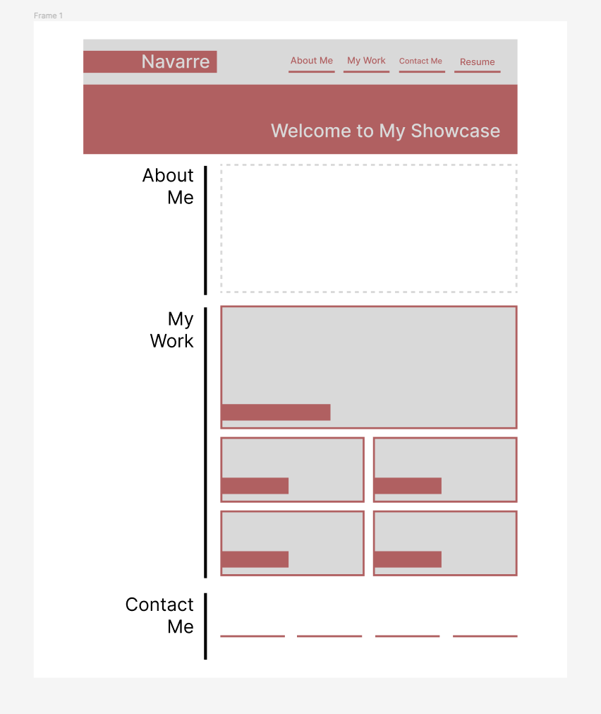
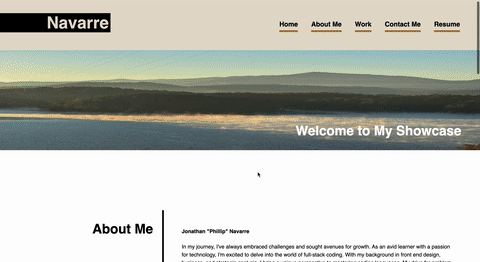

# Portfolio

My Challenge Work Process

    1. Used Gif to layout the webpage

    2. Layed out the webpage by building a html skelton 
    3. Defined Color Pallet
    3. Used html skelton to help build out css page steep by steep of each section
    4. Made sure to link all words, files, and web links
    5. Commented on each section to help with keep track of each section 
    6. Used all resource to help make sure the page was fluent and able to scale

    A. Made sure to use right syntex structure to have code be more presentable (cleaned up)
    B. Added section dividers to each section using this structure: <!--blank-->
    C. Consolidated consolidated code and expanded on classes 

[deployed link](https://one4thenation.github.io/Portfolio/)

    *Updated*
    D. Add + on pictures to create link to new page on (picture snytex kept breaking)
